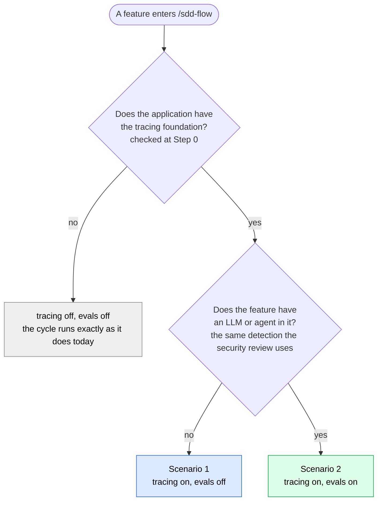
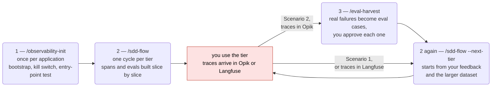
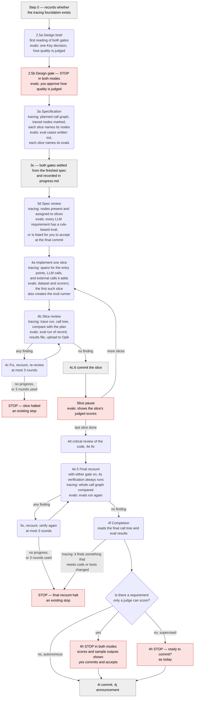
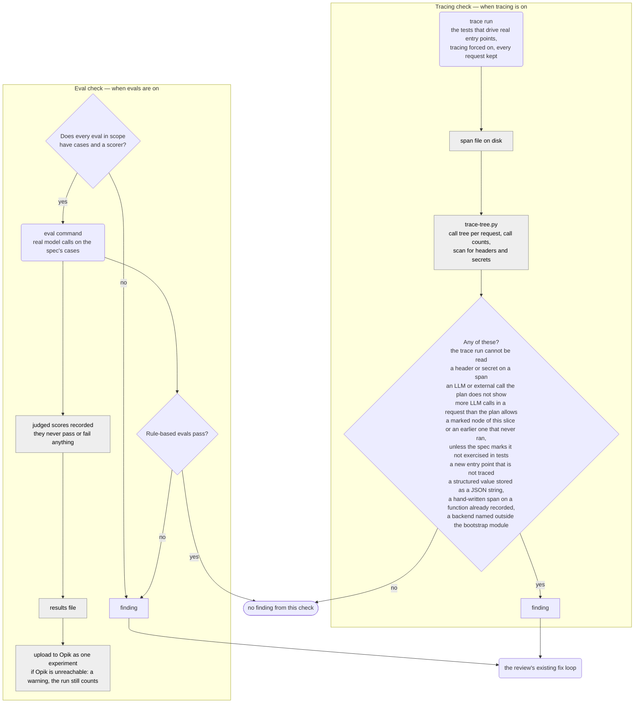
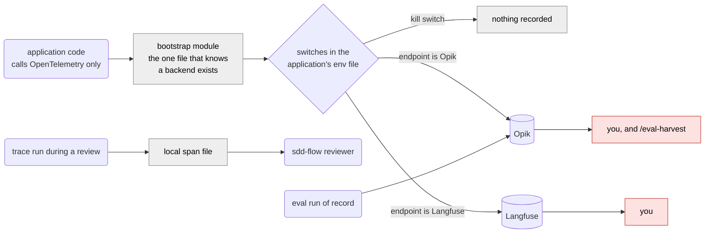

# Tracing and evals in an sdd-flow cycle — at a glance

A picture of where tracing and evals are set up, built, checked, and used in an `/sdd-flow` cycle. **It describes a proposal, built in four steps. As of agent-engineering 3.8.0 steps 1 and 2 exist: `/observability-init` with the tracing standard, and tracing inside `/sdd-flow`. Everything this picture says about evals is not built, and `/eval-harvest` does not exist** — every line starting `evals:`, the eval half of each table, and the 4h change describe the plan, not the plugin. The table at the end says which parts of this picture work. The proposal — `proposals/observability-and-evals-2026-10-04.md` at the repository root — is the source of truth when this picture and it disagree. As each build step ships, this file is updated to say what exists; the cycle itself is in `sdd-flow-diagram.md`, beside this file.

**How to read it.** Same conventions as `sdd-flow-diagram.md`: rounded boxes are work done by a spawned subagent or a skill, red boxes are places the flow **stops and waits for you**, grey boxes are things the orchestrator (the main conversation) or a script does. In boxes that carry both, a line starting `tracing:` applies when tracing is on and a line starting `evals:` when evals are on.

## Two scenarios

The same machinery serves two different needs, and a feature can be in the first without the second.

| | Scenario 1 — any application | Scenario 2 — the application has an LLM or an agent in it |
|---|---|---|
| What it is for | The coding agents and you can see what the application actually did when it ran, without reading the code | That, plus a way to say whether the LLM's output is any good |
| Switched on by | The application has the tracing foundation | The foundation, **and** the feature has a model call, a tool given to a model, a retrieval store feeding a model, agent-to-agent messages, or a model output that drives an action |
| The spec carries | A planned call graph; the entry points, LLM calls, and external calls in it are marked | Also the eval cases, written out, and a maximum number of model calls per request |
| The implementer adds | Spans for the entry points and external calls the feature adds | Also spans for its LLM calls, a dataset, and scorers |
| Recorded with no work by anyone | Every call to the application's own functions (Python 3.12 or later) — names and timing; arguments and results only when a setting asks for them | The same |
| The review checks | The call tree a real run produced, against the plan | Also runs the evals and sends the results to Opik |
| What you are asked | Nothing new | At the design gate: how quality will be judged. At the final commit: whether to accept what only a judge could score |
| After the tier is used | Traces are in Opik or Langfuse to look at | `/eval-harvest` turns real failures into new eval cases — only while traces go to Opik |

The spec can overrule the detection in either direction: `tracing:` and `evals:` each take `auto` (the default, shown above), `true`, or `false`. Asking for either with no foundation stops planning and tells you to change the field or run `/observability-init` before the next cycle (built for `tracing:`; `evals:` does not exist yet).

## Three commands, run at three different times

Tracing and evals are not one thing you switch on. The work is split across three commands — each is a skill you start by typing its name — and you run them at different points in an application's life. `/sdd-flow` is the one you already use; the other two are new, and you run them yourself, outside an `/sdd-flow` cycle.

| | Command | When you run it | What it does |
|---|---|---|---|
| 1 | `/observability-init` | **Once per application, ever** — not once per cycle. At a moment when no `/sdd-flow` cycle is running: for a new application, right after its first cycle finishes | Puts the tracing plumbing into the application: the one module that sends traces, the kill switch, and a test that fails if an entry point is not traced |
| 2 | `/sdd-flow` | Every time you build a feature or a tier, as you do today | Uses that plumbing while it builds: adds tracing for what each slice adds, checks what really ran against the plan, and writes and runs the evals |
| 3 | `/eval-harvest` | After you have used what was built for a while | Looks at the real runs that went wrong and offers them to you as new eval cases, so the next round of building is tested against them |

**Why step 1 is never run in the middle of a cycle.** `/sdd-flow` decides at the start of a cycle whether tracing and evals are on, writes the spec to match, and keeps that answer until the cycle ends. Plumbing installed halfway through changes nothing until the next cycle starts. And it cannot be run on an empty repository: it wires up the framework and entry points it finds, so there has to be something to find.

- **An existing application:** run it once, any time before the next cycle.
- **A new application, starting from nothing:** run `/sdd-flow` on the idea as usual and build its first tier. Nothing about tracing is done or asked for in that cycle. When the cycle is finished, run `/observability-init` once; it instruments what the first cycle built. Every later cycle is traced from its research step on, with no further setup. The only cost is that the first cycle is built without trace checks or evals — a reason to keep the first tier small, not a reason to build an artificial skeleton.

The diagram is the same three commands on a timeline. Step 1 happens once. Steps 2 and 3 repeat: build a tier, use it, harvest what went wrong, build the next tier.

Step 3 applies only to an application with an LLM in it (Scenario 2), and only while its traces go to Opik. Otherwise you go from using a tier straight to building the next one.

## Inside one cycle

What tracing and evals add to each step of the cycle. Steps they do not touch are left out; the per-slice path is shown.

In whole-feature mode the same checks run once in the code review (4b) instead of once per slice. The final recount (4e.5) and everything after it are shared by both modes.

## Inside a review: the two checks

When both gates are on, the eval run is made under the trace run, so the LLM calls it makes show up in the call tree.

As built in 3.8.0, the tracing check is one file every review reads — `skills/sdd-flow/references/tracing-lens.md`. A model call is matched to its planned node by the function that made it; where the tree cannot tell two planned nodes apart, the review says so in its table instead of passing them.

## Where the data goes

**How an `/sdd-flow` review sees what the application did.** It does not look anything up in Opik or Langfuse. The application has one special test command, the *trace run*, that runs the tests and writes a record of every call they made to a file inside the repository. The reviewer reads that file.

The trace run ignores the switches in the table below: it records everything for that one test run, even if you have turned tracing off or set it to record only a fraction of requests. So switching tracing off to save performance never breaks a review, and a review needs no network connection and no keys. It leaves two settings as it finds them, both about recorded text: the one that drops the model's inputs and outputs, and the one that adds the arguments and results of the application's own functions. An application that keeps that text out of its traces keeps it out of this file too.

| To do this | Set in the env file |
|---|---|
| Switch tracing off entirely | `OTEL_SDK_DISABLED=true` |
| Keep spans, drop LLM inputs and outputs | `OTEL_INSTRUMENTATION_GENAI_CAPTURE_MESSAGE_CONTENT=false` |
| Record a fraction of requests | `OTEL_TRACES_SAMPLER=parentbased_traceidratio`, `OTEL_TRACES_SAMPLER_ARG=0.1` |
| Record the arguments and results of the application's own functions (off unless set) | `TRACE_FUNCTION_VALUES=all`, or a list of module names |
| Swap Opik and Langfuse | `OTEL_EXPORTER_OTLP_ENDPOINT` and `OTEL_EXPORTER_OTLP_HEADERS` |

Evals do not swap: they go to Opik only, and `/eval-harvest` works only while traces go to Opik.

## What happens at each stage

| Stage | With tracing on | With evals on | Who does it |
|---|---|---|---|
| `/observability-init` | Writes the bootstrap module, the entry-point wrapper and test, the trace run, and `SDD/OBSERVABILITY.md`; proves that a trace arrives, the kill switch, and that the test can fail | — | A skill you run, once per application |
| 0 Scope | Records whether the foundation exists | Same record | Orchestrator |
| 2.5 Design brief and gate | — | The brief states how quality will be judged; you approve it | Opus subagent, then you |
| 3a Specification | Planned call graph; each slice lists its traced nodes | Eval cases; each slice lists its evals | Sonnet subagent |
| 3c Panel | Gate settled and recorded | Gate settled and recorded | Orchestrator |
| 3d Spec review | Checks the graph and the slice lists | Checks every LLM requirement has a rule-based eval or is listed for you to accept at the final commit | Opus subagent |
| 4a Implement | Spans for what the slice adds, nothing else | Dataset, scorers; eval runner on first use | Sonnet subagent |
| 4b Review | Trace run, call tree, comparison with the plan | Eval run of record, results file, upload | Sonnet subagent |
| 4e.5 Final recount | Whole graph compared after every fix has landed; every finding, low-severity ones included, is fixed before completion | Evals run again after every fix has landed | Sonnet subagents |
| 4f Completion | Summary filled from the final call tree. It changes no code or test: if it finds something that needs either, the flow stops and the final check runs again after you resume | Judged requirements listed with their scores | Sonnet subagent |
| 4h Commit question | — | Fires in both modes when a requirement can only be judged; yes accepts it | You |
| `/eval-harvest` | Reads the tier's real traces from Opik; stops if the application sends them to Langfuse | Proposes failures as new cases; writes the ones you approve | A skill you run, after using the tier |

## What changes about the stops

The proposal added no stop. As built, tracing has one of its own — the first row — and two existing ones change.

| Stop | Today | With the proposal |
|---|---|---|
| Tracing asked for and not possible (3c) — **built in 3.8.0** | Did not exist | The spec says `tracing: true` and the application had no tracing foundation when the cycle started, or the field holds an invalid value. You change the field; nothing is reviewed until you do |
| Before the final commit (4h) | Supervised mode only | Also in autonomous mode, when the spec has a requirement only a judge can score. It shows the scores and sample outputs, and yes accepts them |
| Final recount halt (4e.5) | The final recount's verification still has open findings after 3 fix rounds, or a round made no progress | The same, with tracing and eval findings counted among them — low-severity ones included. **Built in 3.8.0 for tracing**, where it also fires when completion finds something that needs code or tests changed after the final check |
| Slice fix-loop halt (4c) | A slice did not pass its review in 3 fix rounds, or a round made no progress | Unchanged — tracing and eval findings are ordinary review findings |
| Slice pause | Shows the brief check line | Also shows the slice's judged scores |

## What exists after each build step

| Build step | What it ships | Which parts of this picture then work |
|---|---|---|
| 1 — **shipped in 3.7.0** | `/observability-init` and the tracing standard (`skills/observability-init/references/tracing.md`) | In "Where the data goes": application tracing, the switches, the choice of backend, and the local span file — for a Python application, outside the flow. Run on the trial application on 2026-10-07, sending to Opik; sending to Langfuse is not yet proven. Not the eval run or `/eval-harvest` |
| 2 — **shipped in 3.8.0** | Tracing in `sdd-flow`: the `tracing:` gate, the planned call graph, the implementer's tracing step, the trace check in every review and at the final recount, `trace-tree.py`. Also, in `/observability-init`: every call to the application's own functions recorded automatically, with a cap on repeats | Scenario 1 end to end, and every line starting `tracing:` in "Inside one cycle" — except the design brief, which does not mention the gate until step 3. Not yet used to build a feature end to end; the trial application's next piece is that proof |
| 3 — not built | Evals in `sdd-flow` | Scenario 2 inside a cycle |
| 4 — not built | `/eval-harvest` | The loop from a used tier back into the next one |
