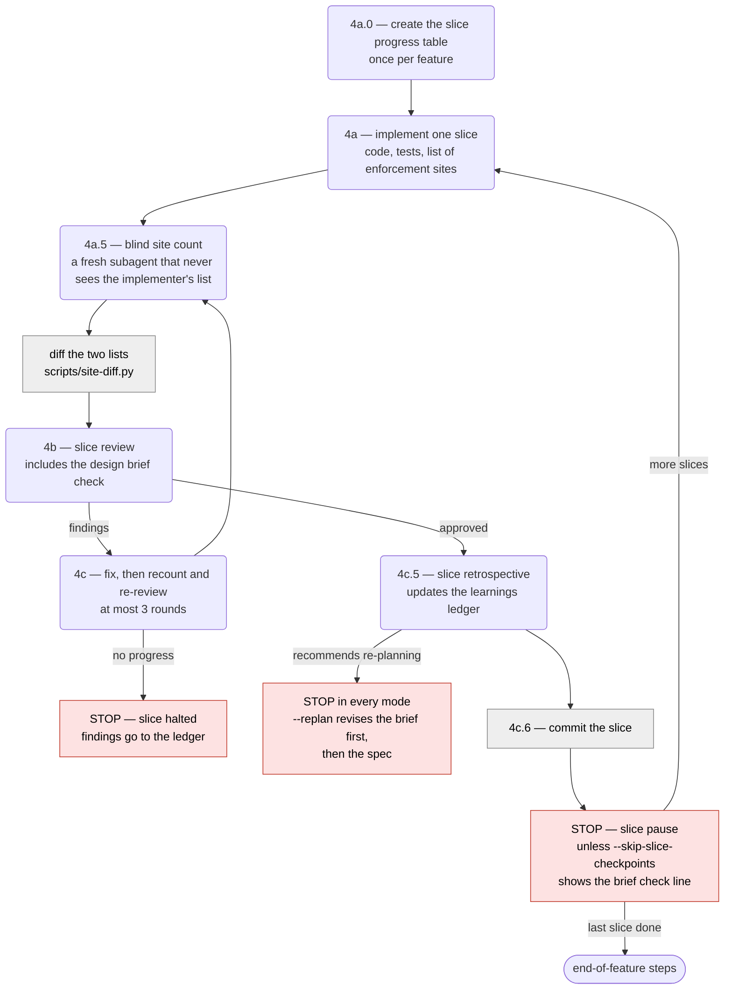
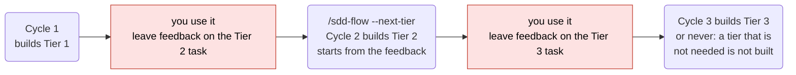

# sdd-flow — the development cycle at a glance

A picture of what `/sdd-flow` does, stage by stage, as of agent-engineering 3.5.0. It is a reading aid for people: the flow itself runs from `skills/sdd-flow/SKILL.md` and the files under `skills/sdd-flow/phases/`, and those are the source of truth when this page and they disagree.

**How to read it.** Rounded boxes are work done by a spawned subagent. Red boxes are places the flow **stops and waits for you**. Grey boxes are things the orchestrator (the main conversation) does itself: commits, running a script, recording state.

## The whole cycle

```mermaid
flowchart TD
    start(["/sdd-flow task"]) --> s0("Step 0 — Scope<br/>does this fit one cycle?")
    s0 -- "too large" --> decomp["STOP — decomposition written<br/>you run /sdd-flow per item"]:::stop
    s0 -- "fits" --> s1["Step 1 — Mode<br/>supervised or autonomous"]:::orch
    s1 --> s15["Step 1.5 — Clarification gate<br/>STOP in both modes<br/>you run /research-clarify"]:::stop
    s15 --> s2("Step 2 — Research<br/>2a research and completeness check<br/>2b capture ADRs<br/>2c critical review, 2d fix findings")
    s2 --> c2["2e commit research"]:::orch
    c2 --> s25a("Step 2.5a — Design brief<br/>at most 150 lines, plain language<br/>proposes three tiers, writes the tier plan")
    s25a --> gate["Step 2.5b — Design gate<br/>STOP in both modes<br/>answer questions, pick a tier, approve"]:::stop
    gate -- "answers or changes" --> s25c("2.5c — Revise the brief")
    s25c --> gate
    gate -- "approve" --> m1["Mirror tiers to BB tasks<br/>tier being built: in progress"]:::orch
    m1 --> s3a("Step 3a — Specification<br/>covers the approved tier only<br/>lists what is deferred")
    s3a --> s3c("3b capture ADRs<br/>3c specialist panel, in parallel<br/>then one synthesis")
    s3c -- "findings" --> fix3("fix the spec, re-run the panel<br/>at most 3 rounds")
    fix3 --> s3c
    fix3 -- "no progress" --> halt3["STOP — panel halt<br/>you fix the spec by hand"]:::stop
    s3c -- "proceed" --> s3d("3d critical review of the spec<br/>3e fix all findings")
    s3d --> c3["3f commit planning"]:::orch
    c3 --> s3g{"3g — does the spec depart<br/>from the approved brief?"}
    s3g -- "yes" --> dev["STOP in both modes<br/>deviations shown, you accept or edit"]:::stop
    dev --> s4
    s3g -- "no" --> s4{"Step 4 — Implementation<br/>route on delivery mode"}
    s4 -- "per-slice" --> slices("Per-slice cycle<br/>see the next diagram")
    s4 -- "whole-feature" --> wf("4a implement<br/>4a.5 blind site count and diff<br/>4b code review, 4c fix")
    slices --> eof
    wf --> eof("4d critical review of the code, 4e fix<br/>4e.5 final blind recount<br/>4f completion: summary, tier plan updated")
    eof --> m2["Mirror: tier in review"]:::orch
    m2 --> s4h["4h — STOP, supervised mode only<br/>ready to commit?"]:::stop
    s4h --> c4["4i commit implementation"]:::orch
    c4 --> done["4j — Mirror: tier done<br/>announcement, progress file rotated"]:::orch
    done --> next(["later: /sdd-flow --next-tier<br/>a new cycle for the next tier"])

    classDef stop fill:#fde2e2,stroke:#c0392b,color:#000
    classDef orch fill:#eeeeee,stroke:#888888,color:#000
```

## Inside per-slice implementation

When the spec says `delivery_mode: per-slice` (the default for new specs), this loop runs once per slice, in order. Then the end-of-feature steps in the diagram above run once.

## What happens at each stage

| Stage | What is done | Who does it | What it writes (under `SDD/`) | Where it can stop |
|---|---|---|---|---|
| 0 Scope | Decides whether the request fits one cycle. `--next-tier` instead reads the tier plan and copies task comments into its Feedback | Sonnet subagent | `flow/DECOMPOSITION-*` (only when too large) | Always, when the feature is too large |
| 1 Mode | Supervised or autonomous | Orchestrator | — | — |
| 1.5 Clarification | An interview that gets your design concept written down. On a next-tier cycle it is a feedback interview instead | You, with `/research-clarify` | `research/CLARIFICATION-*` | Both modes, unless `--skip-clarify` or the file exists |
| 2 Research | Investigates the codebase; captures cross-cutting decisions as ADRs; adversarial review; fixes | Sonnet subagents; Opus for the review | `research/RESEARCH-*`, `reviews/CRITICAL-RESEARCH-*`, `adr/*` | — |
| 2.5 Design gate | Writes the one planning document meant for you: what will be built, decisions, footprint, tiers, questions. Then waits | Opus subagent writes; you approve | `requirements/DESIGN-*`, `flow/TIERS-*` | **Both modes, every time the brief is written or rewritten.** `approve` is refused while a question is open |
| 3 Planning | Writes the spec for the approved tier; specialist panel and adversarial review; fixes. The spec must record every departure from the brief | Sonnet subagents; Opus for synthesis and review | `requirements/SPEC-*`, `reviews/PANEL-*`, `reviews/CRITICAL-SPEC-*` | Panel halt after 3 rounds or no progress. **3g, both modes, when the spec departs from the brief** |
| 4 Implementation | Builds the feature (whole, or slice by slice). Every control is counted twice — by the implementer and by a blind subagent — and the lists are diffed. Code review, adversarial review, fixes, final recount, completion | Sonnet subagents; Opus for the adversarial review | code and tests, `implementation/*`, `reviews/REVIEW-*`, `reviews/SITE-*`, `reviews/CRITICAL-IMPL-*` | Slice pauses (per-slice). Re-planning halt (every mode). Recount halt. 4h before the final commit (supervised only) |
| Done | Tier marked shipped in the tier plan; task set to done; announcement names what shipped and what is left | Orchestrator | updated `flow/TIERS-*` | — |

## What the stops are for

| Stop | Supervised | Autonomous | Why it exists |
|---|---|---|---|
| Decomposition (Step 0) | stops | stops | The request is too large for one cycle |
| Clarification (1.5) | stops | stops | Your intent has to be written down before research |
| Design gate (2.5) | stops | stops | You approve *what will be built* before anything is specified |
| Deviation check (3g) | stops if deviations | stops if deviations | The spec is no longer what you approved |
| Slice pause | stops | stops | Review each slice while it is small. Off with `--skip-slice-checkpoints` |
| Re-planning halt | stops | stops | A slice showed the plan is wrong |
| Before the final commit (4h) | stops | does not stop | Last look before everything is committed |

## Tiers across cycles

A feature is delivered in up to three tiers — Tier 1 POC-plus, Tier 2 Standard, Tier 3 Full — and each tier is one full pass through the first diagram. The rules for what belongs in which tier live in `skills/simplicity-challenge/references/tiers.md`.

The tier plan (`SDD/flow/TIERS-[feature-name].md`) carries what shipped, what was deferred, and the feedback from one cycle to the next. BB tasks mirror it: one parent task per feature, one sub-task per tier.
